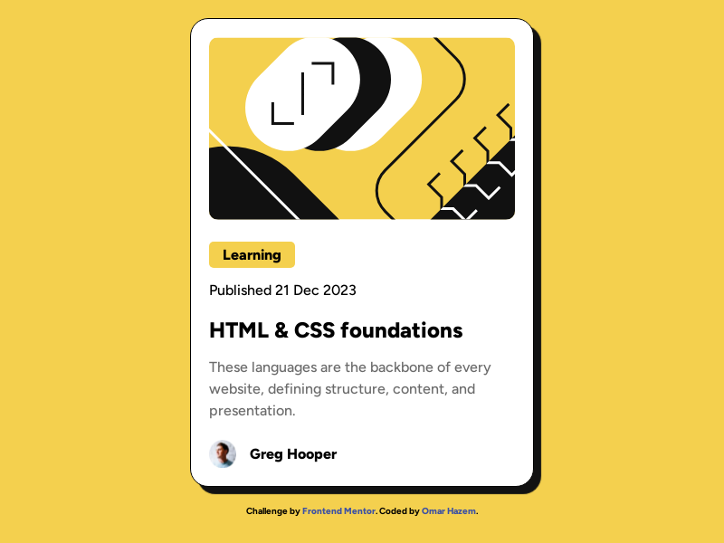

# Frontend Mentor - Blog preview card solution

This is a solution to the [Blog preview card challenge on Frontend Mentor](https://www.frontendmentor.io/challenges/blog-preview-card-ckPaj01IcS). Frontend Mentor challenges help you improve your coding skills by building realistic projects. 

## Table of contents

- [Overview](#overview)
  - [The challenge](#the-challenge)
  - [Screenshot](#screenshot)
  - [Links](#links)
- [My process](#my-process)
  - [Built with](#built-with)
  - [What I learned](#what-i-learned)
  - [Continued development](#continued-development)
  - [Useful resources](#useful-resources)
- [Author](#author)
- [Acknowledgments](#acknowledgments)


## Overview

I built a simple, responsive webpage featuring a blog preview card, designed using only HTML and CSS.

### The challenge

Users should be able to:

- See hover and focus states for all interactive elements on the page

### Screenshot



### Links

- Live Site URL: https://omarhazem02.github.io/Blog-preview-card/

## My process

 I started by analyzing the provided design and breaking it down into clear sections and individual elements. This made it easier to structure the HTML, assigning descriptive class names to each part for better readability and maintainability.

Once the HTML skeleton was complete, I worked from top to bottom, styling each section step-by-step with CSS until the design matched the challenge requirements.

### Built with

- Semantic HTML5 markup
- CSS custom properties
- Flexbox

### What I learned


To see how you can add code snippets, see below:

```html
<h1>Some HTML code I'm proud of</h1>
```
```css
.proud-of-this-css {
  color: papayawhip;
}
```

### Continued development


### Useful resources

- MDN Web Docs helped me expand my knowledge on certain topics while creating this page..
- Chat gpt Claude supported me as  mentors by helping evaluate and review my code throughout the project.
  
## Author

- Website - [Omar Hazem](https://www.linkedin.com/in/omar-hazem-aa287a273/)
- Twitter - [@Omarhaz67778375](https://x.com/OmarHaz67778375)


## Acknowledgments

I would like to acknowledge AlMadersa, where I am currently studying in the Front-End Development Diploma program.
Special thanks to my course tutor, Mohamed Abu Sarea (محمد أبو سريع), for his valuable guidance and support.

